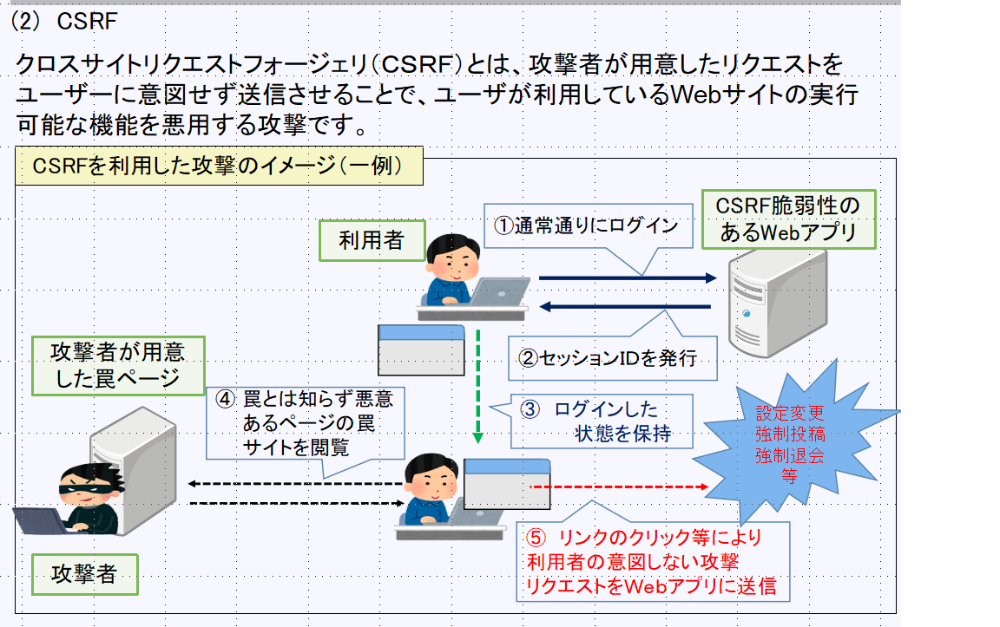
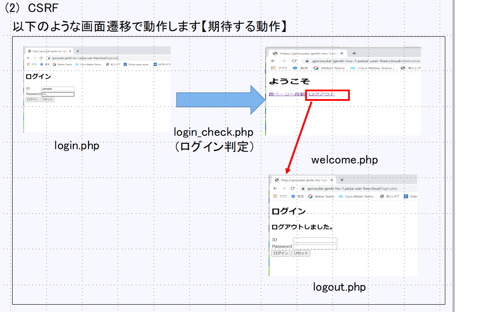
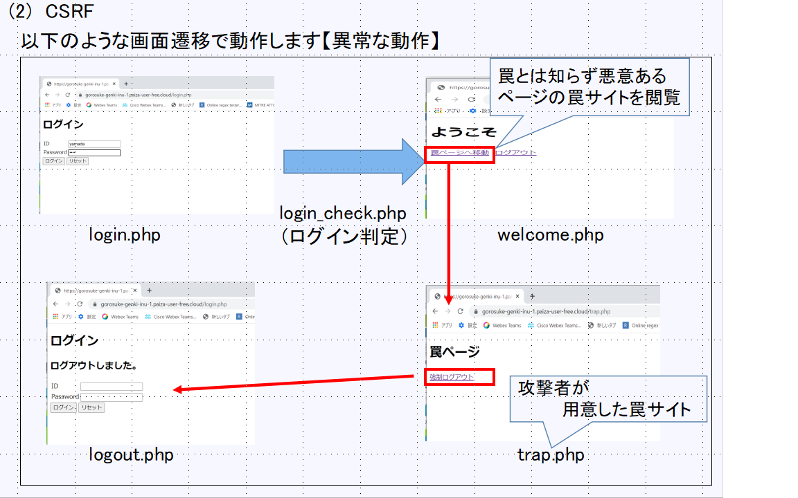
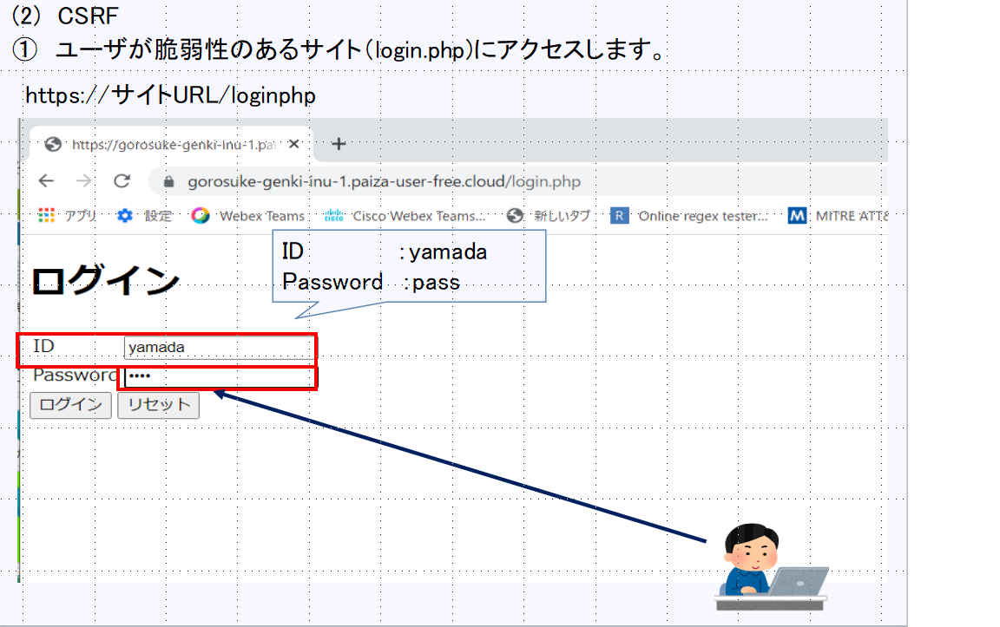
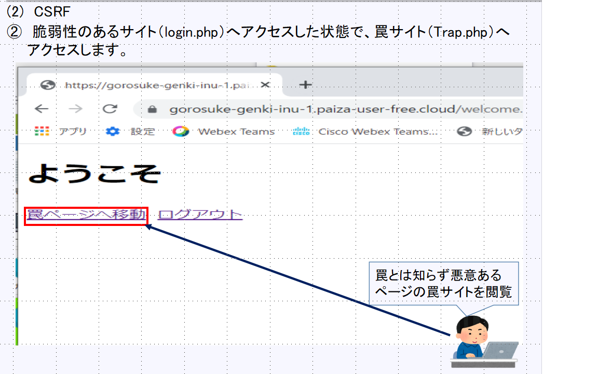
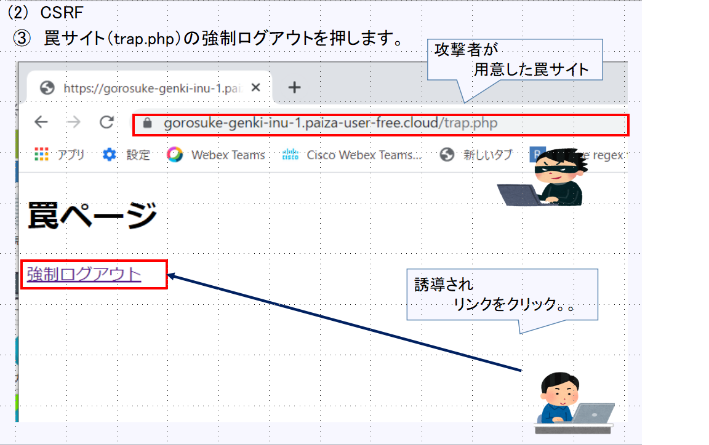
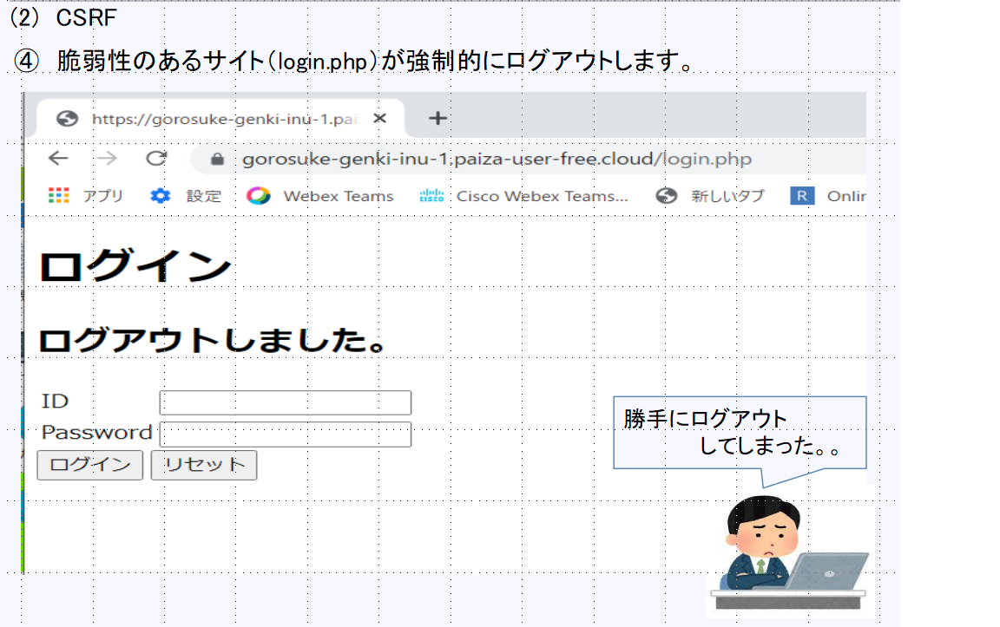
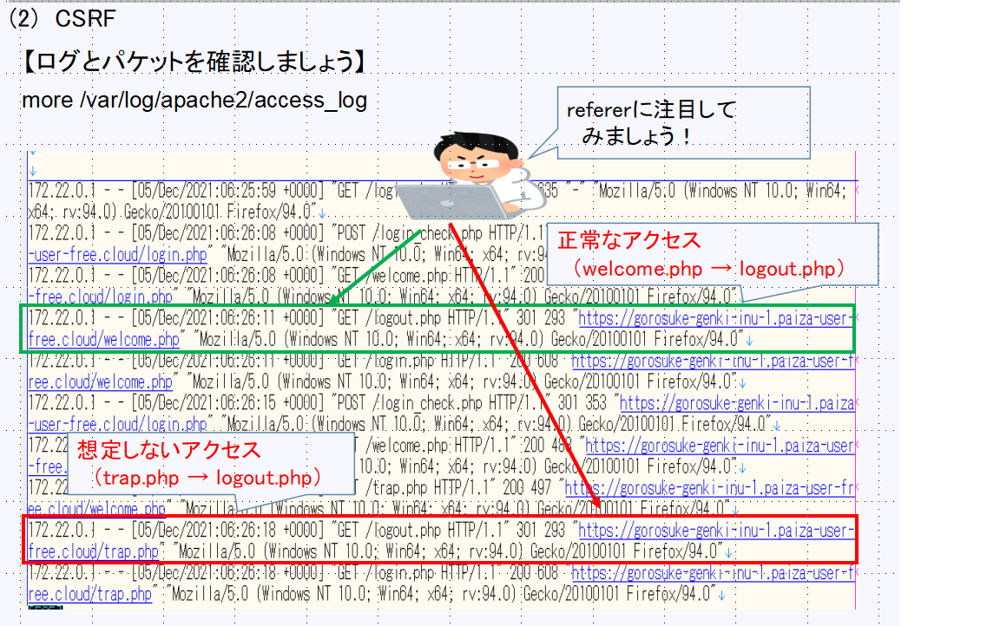
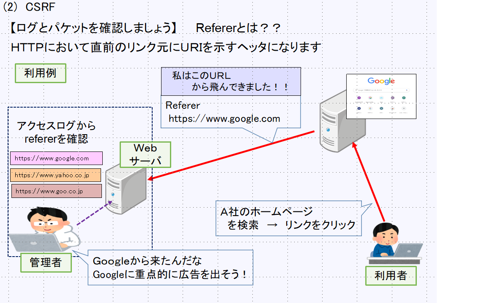

# CSRFとは？？ 
  

https://www.ipa.go.jp/security/vuln/websecurity/csrf.html

## 【体験要領】

### サイト構成 
以下のようなサイト構成を例として実習します 

#### 正常な動作 
  

#### 異常な動作 
  

#### 正常な動作の確認 
〇　脆弱性のあるサイト（login.php)にアクセスし、ユーザ/パスワードを入力します 
〇　トップページ（welcome.php）においてログアウトボタンを押します 
〇　ログアウト画面（logout.php)が表示され、ログアウトします 
 　　   
#### 異常な動作の確認 
〇　脆弱性のあるサイト（login.php)にアクセスし、ユーザ/パスワードを入力します 
 　　 
〇　トップページ（welcome.php）において罠サイトボタンを押します 
 　　 
〇　罠サイト（trap.php）の強制ログアウトボタンを押します 
 　　 
〇　ログアウト画面（logout.php）が表示され、ログアウトします 
 　　　　 

### パケットとログを確認してみましょう！！ 
〇　Webサーバのアクセスログからreferrerに注目します！ 
 
 

[目次に戻る](./README.md)  
