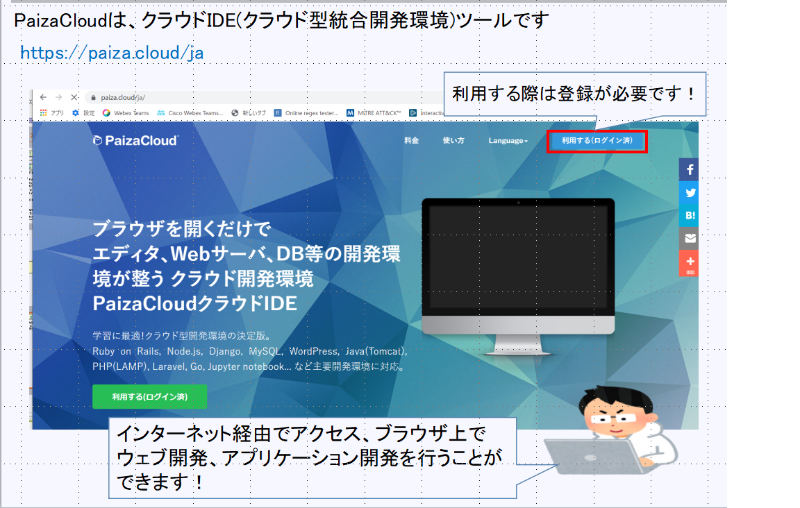
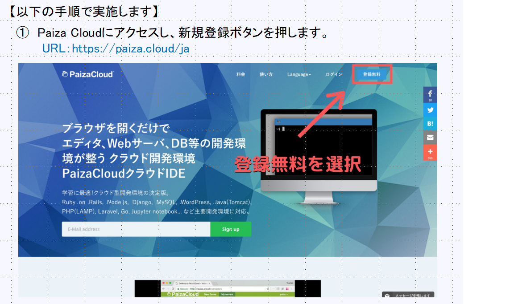
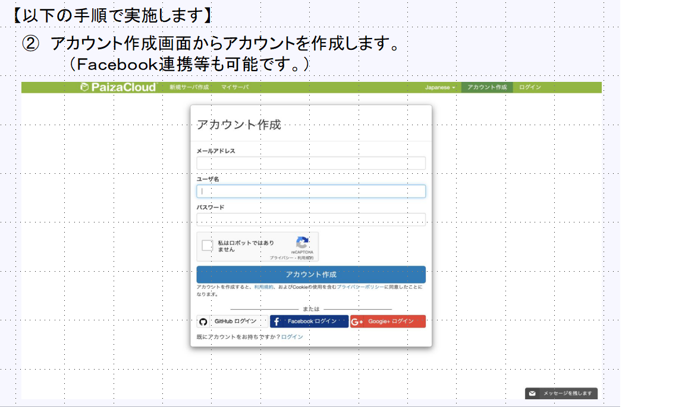
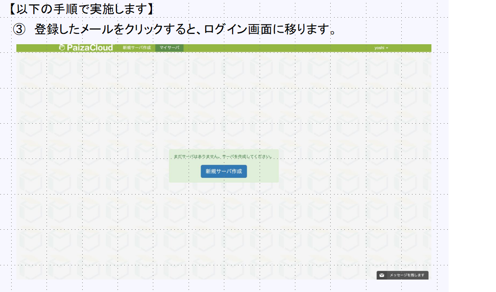
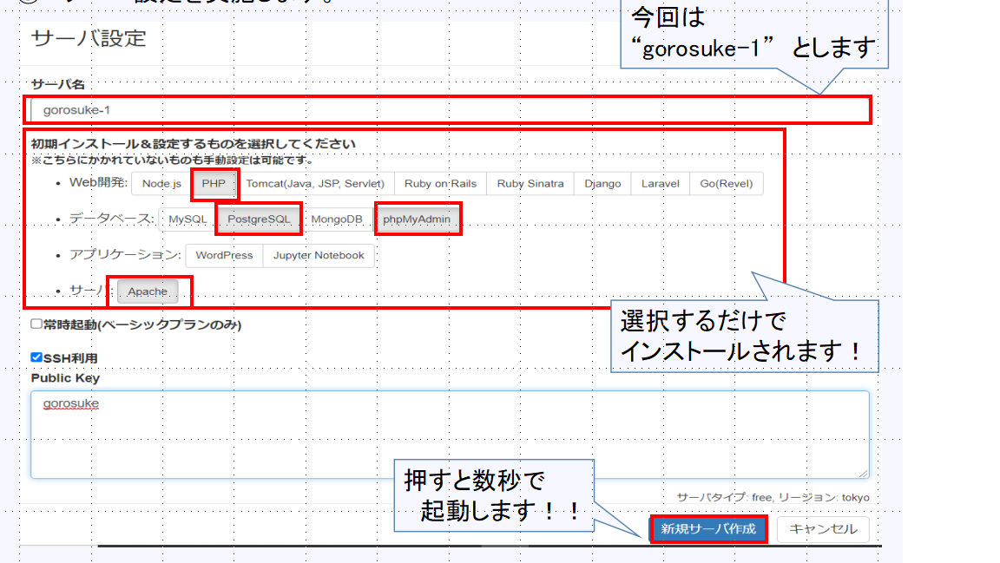
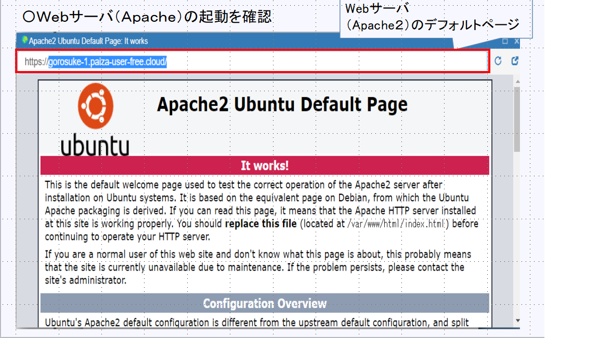

# paiza-cloudとは？？ 
  
ブラウザを開くだけでエディタ、Webサーバ、DB等の開発環境が完了、OSの種類やバージョンなどに関係なくすぐに開発を進めることができる、学習や研修に最適なサービスです 

紹介サイト 
https://www.paiza.co.jp/news/20171205/287/) 

# paiza-cloudの使用方法 
  
  
  
  
 ## 起動したいサービス等を選択し、新規サーバ作成をクリックします！) 
  
 ## インターネット上の端末から作成したサーバにアクセスが可能です！！) 
  

[目次に戻る](./README.md)  
