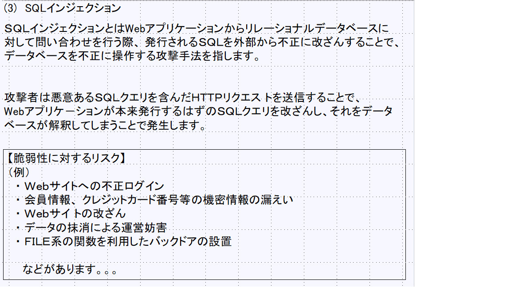

# SQLインジェクションとはとは？？ 
  

## 【体験要領】

### サイト構成 
以下のようなサイト構成を例として実習します 

####事前準備
#####　①データベースの作成 

PaizaCloud上にあるDBサーバー（MYSQL）にログインし、以下の作業を実施 
PaizaCloudのWeb画面に左側にあるコンソールを起動 
sudo su でrootになっておく 

〇MYSQLにルートでログイン 
　　root@gorosuke-genki-inu-1:/home/ubuntu# mysql -u root
　　　　　パスワードはなし（Enterを押す） 

〇ユーザを登録（パスワード設定あり）します。
　　mysql> CREATE USER gorosuke5656 IDENTIFIED BY '1qaz2wsx3edc$';
　　　　　Query OK, 0 rows affected (0.01 sec)
　

〇ログアウトして先ほど登録したユーザログインを実施します。
　　root@gorosuke-genki-inu-1:/home/ubuntu# mysql -u gorosuke5656 -p
　　Enter password:1qaz2wsx3edc$(表示されない）
　　Welcome to the MySQL monitor.  Commands end with ; or \g.
　　Your MySQL connection id is 4
　　　・
　　mysql>

〇データベースを確認

mysql> show databases;
+--------------------+
| Database           |
+--------------------+
| information_schema |
+--------------------+
1 row in set (0.01 sec)

mysql>

〇ログアウトして、再度rootでログイン後、作成ユーザに権限を持たせる

root@gorosuke-genki-inu-1:/home/ubuntu# mysql -u root -p
Enter password:→　”Ｅnterを押す”
Welcome to the MySQL monitor.  Commands end with ; or \g.
Your MySQL connection id is 5
Server version: 5.7.28-0ubuntu0.18.04.4 (Ubuntu)

Copyright (c) 2000, 2019, Oracle and/or its affiliates. All rights reserved.

Oracle is a registered trademark of Oracle Corporation and/or its
affiliates. Other names may be trademarks of their respective
owners.

Type 'help;' or '\h' for help. Type '\c' to clear the current input statement.

mysql> GRANT ALL PRIVILEGES ON *.* TO gorosuke5656@localhost IDENTIFIED BY '1qaz2wsx3edc$';
Query OK, 0 rows affected, 1 warning (0.00 sec)

mysql>

〇再度作成ユーザ(gorosuke5656)でログイン

root@gorosuke-genki-inu-1:/home/ubuntu# mysql -u gorosuke5656 -p
Enter password:
Welcome to the MySQL monitor.  Commands end with ; or \g.
Your MySQL connection id is 6
Server version: 5.7.28-0ubuntu0.18.04.4 (Ubuntu)

Copyright (c) 2000, 2019, Oracle and/or its affiliates. All rights reserved.

Oracle is a registered trademark of Oracle Corporation and/or its
affiliates. Other names may be trademarks of their respective
owners.

Type 'help;' or '\h' for help. Type '\c' to clear the current input statement.

mysql>
mysql> show databases;
+--------------------+
| Database           |
+--------------------+
| information_schema |
| mysql              |
| performance_schema |
| sys                |
+--------------------+
4 rows in set (0.00 sec)

mysql>

○データベースを作成
#mysqlにログイン
$ mysql -u gorosuke5656 -p

#testuserという名前のデータベースを作成
CREATE DATABASE testuser;

#データベース”testuser”を指定
mysql>use testuser;

#usersというテーブルを作成し、カラムを「uid、passwd、mail」として作成
CREATE TABLE testuser.users (uid varchar(20), passwd varchar(20), mail varchar(20));

INSERT INTO testuser.users (uid , passwd , mail) VALUES ('gorosuke5656', 'password', 'gorosuke@gmail.com');
INSERT INTO testuser.users (uid , passwd , mail) VALUES ('test', 'test', 'test@tttttt.com');
INSERT INTO testuser.users (uid , passwd , mail) VALUES ('sqliuser', 'sqlipass', 'sqli@sqlidsada.com');

〇select文でテーブル"users"を確認

mysql> select * from testuser.users;
+-----------+----------+--------------------+
| uid       | passwd   | mail               |
+-----------+----------+--------------------+
| tokoroten | password | aasdawds@gmail.com |
| test      | test     | test@tttttt.com    |
| sqliuser  | sqlipass | sqli@sqlidsada.com |
+-----------+----------+--------------------+
3 rows in set (0.00 sec)

mysql>

〇あらためてログインからテーブル確認まで確認

$ mysql -u gorosuke5656 -p
Enter password:
Welcome to the MySQL monitor.  Commands end with ; or \g.
Your MySQL connection id is 12
Server version: 5.7.28-0ubuntu0.18.04.4 (Ubuntu)

Copyright (c) 2000, 2019, Oracle and/or its affiliates. All rights reserved.

Oracle is a registered trademark of Oracle Corporation and/or its
affiliates. Other names may be trademarks of their respective
owners.

Type 'help;' or '\h' for help. Type '\c' to clear the current input statement.

mysql>

Copyright (c) 2000, 2019, Oracle and/or its affiliates. All rights reserved.

Oracle is a registered trademark of Oracle Corporation and/or its
affiliates. Other names may be trademarks of their respective
owners.

Type 'help;' or '\h' for help. Type '\c' to clear the current input statement.

mysql> use testuser
Reading table information for completion of table and column names
You can turn off this feature to get a quicker startup with -A

Database changed
mysql> select * from testuser.users;
+--------------+----------+--------------------+
| uid          | passwd   | mail               |
+--------------+----------+--------------------+
| gorosuke5656 | password | gorosuke@gmail.com |
| test         | test     | test@tttttt.com    |
| sqliuser     | sqlipass | sqli@sqlidsada.com |
+--------------+----------+--------------------+
3 rows in set (0.01 sec)

mysql>

(正常な動作の確認） 
〇　脆弱性のあるサイト（login.php)にアクセスし、ユーザ/パスワードを入力します 
〇　トップページ（welcome.php）においてログアウトボタンを押します 
〇　ログアウト画面（logout.php)が表示され、ログアウトします 
 　　   
（異常な動作の確認） 
〇　脆弱性のあるサイト（login.php)にアクセスし、ユーザ/パスワードを入力します 
 　　 
〇　トップページ（welcome.php）において罠サイトボタンを押します 
 　　 
〇　罠サイト（trap.php）の強制ログアウトボタンを押します 
 　　 
〇　ログアウト画面（logout.php）が表示され、ログアウトします 
 　　　　 

### パケットとログを確認してみましょう！！ 
 
 
